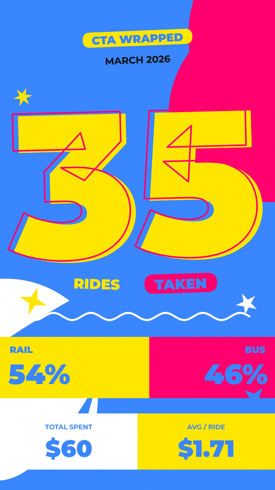
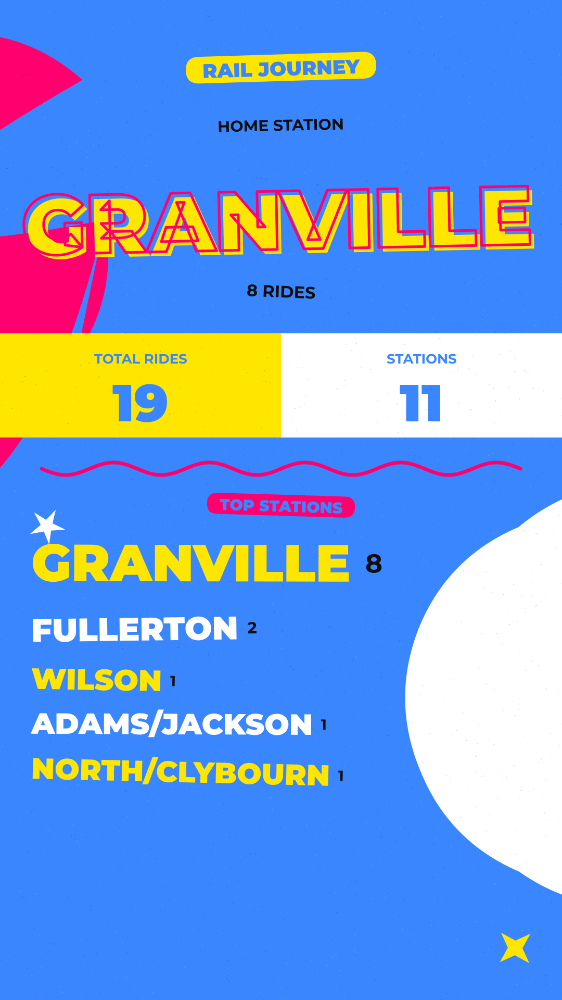
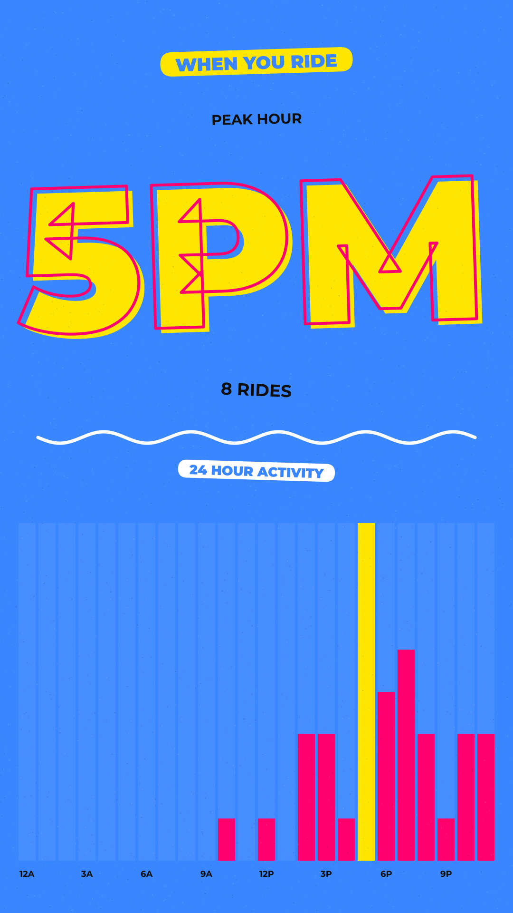
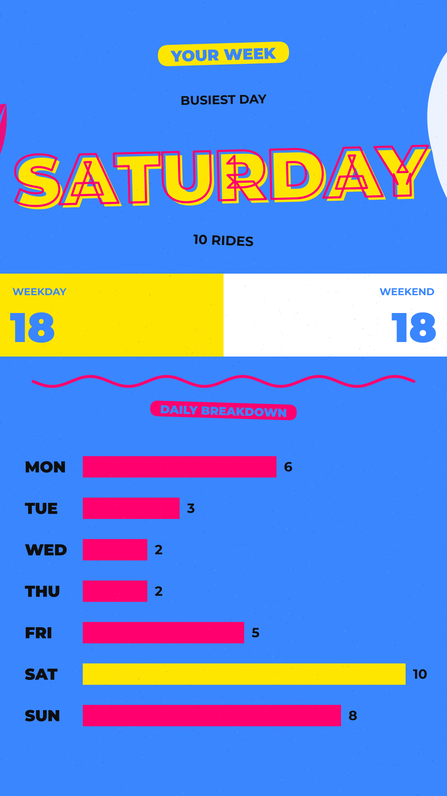
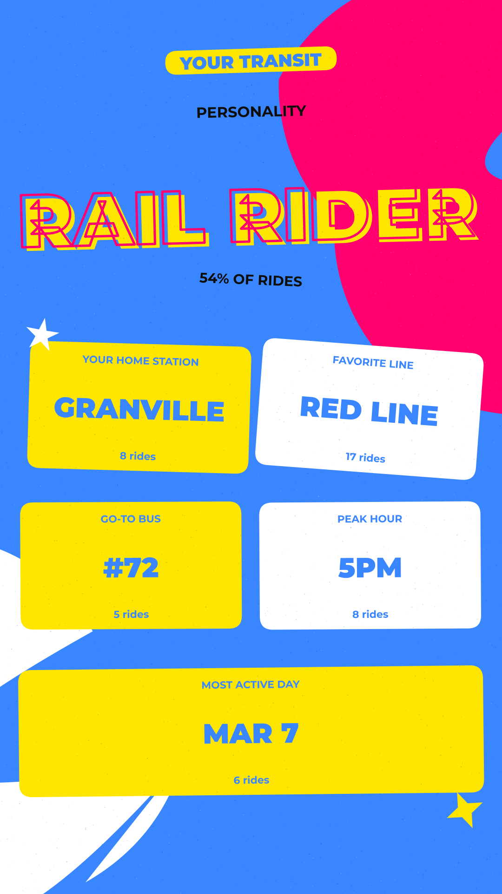

# CTA Wrapped
Node.js scripts to fetch and store your Ventra transit card usage history, and generate usage visuals. Note this does not support Metra data.

## Overview
### fetch.js
This script logs into your Ventra account and pulls your recent transaction history, storing it locally in a JSON file. It's designed to run periodically (e.g., weekly via cron) to build up a complete dataset of your transit usage throughout the year. Ventra's APIs only return up to 100 individual account usage events, which is why this script should be run periodically to capture your usage.

#### How It Works
1. **Login** - Authenticates with your Ventra username and password
2. **Get Token** - Extracts the CSRF verification token from your account page
3. **Fetch Transactions** - Calls the Ventra API to retrieve your transaction history
4. **Merge & Deduplicate** - Adds only new transactions to your existing data file
5. **Clean & Filter** - Removes HTML tags from dates and filters out "Sale" transactions (when you add money to your card)

### generate_wrapped.js
This script analyzes Ventra usage data locally and generates 6 shareable **1080×1920 PNG images** (Instagram Stories / 9:16 format) with usage data by month or year (using Canvas) in `wrapped_images/`.

| # | Image | Contents |
|---|-------|----------|
| 1 | `overview` | Hero ride count, hard-block rail vs bus split, total spent and avg per ride |
| 2 | `rail` | Home station hero, total rides + unique stations, top 5 stations as a typographic stack sized by ride count |
| 3 | `bus` | Go-to bus route as oversized hero, other routes as scattered colored stickers, total + unique routes |
| 4 | `time-of-day` | Peak hour hero, sculptural 24-bar hourly chart with peak hour highlighted |
| 5 | `day-of-week` | Busiest day hero, weekday vs weekend hard split, daily bar chart with busiest day highlighted |
| 6 | `personality` | Transit style hero, supporting insights as scattered sticker tags (home station, favorite line, go-to bus, peak hour, most active day) |

Each image uses a deterministic palette picked from the period (so March 2026 always renders in the same colors, but April 2026 may render in a different palette).

<p float="middle">
  
  
  
</p>
<p float="middle">
  
  
  
</p>

#### Data Cleaning
Station names from the Ventra API are normalized before display:
- Platform prefixes stripped (`SS` = State Street, `DB` = Dearborn/Downtown Branch)
- Blue line branch suffixes stripped (e.g. `Western_O'Hare` → `Western`)
- Underscores replaced with spaces (e.g. `Logan_Square` → `Logan Square`)
- Hyphenated cross-streets normalized to slash (e.g. `Jackson-VanBuren` → `Jackson/VanBuren`)
- Unidentifiable bus entries (Deadhead, route 0) excluded from route rankings but still counted toward total ride stats

#### Fonts
The visuals use [Montserrat](https://fonts.google.com/specimen/Montserrat). Font files (Regular, SemiBold, Bold, ExtraBold, Black) must be present in a `fonts/` directory. Download from Google Fonts and place the static TTF files there.

## Requirements
- Node.js 18+ (for built-in `fetch` API)
- A Ventra account
- Montserrat font files in `fonts/` (see above)

## Setup

`npm ci` to install dependencies

### Finding Your Transit Account ID

1. Log into your Ventra account at https://www.ventrachicago.com
2. Navigate to your transaction history page
3. Open Chrome DevTools (F12 or right-click → Inspect)
4. Go to the **Network** tab
5. Refresh the page or scroll through your transactions
6. Look for a request to `GetTransactionHistory`
7. Click on it and view the **Payload** or **Request** tab
8. Find the `TransitAccountId` field - this is your encrypted account ID
9. Copy this value

### Create keys.js

Create a `keys.js` file in the same directory:
```javascript
module.exports = {
    ventraKeys: {
        username: 'your_ventra_username',
        password: 'your_ventra_password',
        transitAccountId: 'your_transit_account_id'
    },
    email: {
        service: 'gmail',
        user: '...@gmail.com',
        password: '...',
        to: '...@gmail.com'
    },
};
```

## Usage
### Fetching Ventra Data

Run the script manually:
```bash
node fetch.js
```
Or set up a weekly cron job (runs every Sunday at 2 AM):
```bash
crontab -e
```
Add this line:
```
0 2 * * 0 cd /path/to/script && node fetch.js >> fetch.log 2>&1
```

#### Output
The script creates/updates `ventra_transactions.json` with the following structure:
```json
{
  "transactions": [
    {
      "formattedDate": "01/31/2026 9:40:59 AM",
      "formattedAmount": "-$2.50",
      "timestamp": 1738323659000,
      "transactionType": "Use",
      "type": "Rail",
      "locationRoute": "Red-Thorndale",
      "amount": -250
    }
  ],
  "lastUpdated": "2026-01-31T12:00:00.000Z",
  "totalTransactions": 150
}
```

#### Notes
- Only "Use" and "Transfer" transactions are stored. Sales (Ventra account reloads) are filtered out
- Duplicate transactions are automatically skipped
- Transactions are sorted by date (most recent first)

### Generating Summary Images

```bash
node generate_wrapped.js 2026      # Full year
node generate_wrapped.js 2026 1    # Specific month (January)
node generate_wrapped.js 2026 3    # March only
```

For monthly wraps, the personality slide shows **Most Active Day** instead of Busiest Month (since all data is already from that month).
